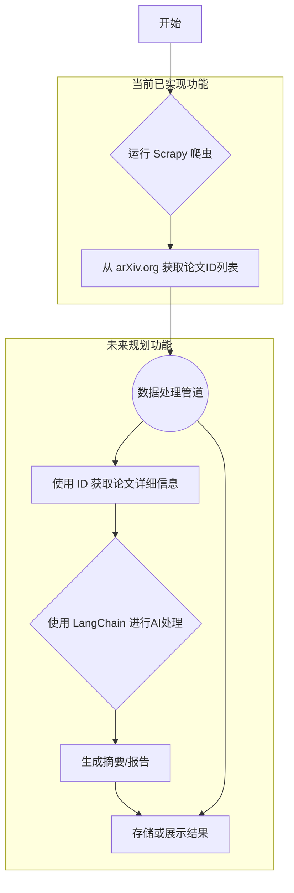

# 功能地图

本文档使用 [Mermaid.js](https://mermaid-js.github.io/mermaid/) 语法可视化展示项目核心功能之间的关系和依赖。

## 核心工作流

### 图例说明

- **菱形 (B)**: 代表一个自动化的处理步骤或决策点，这里是运行爬虫。
- **矩形 (C, E, F, G, H)**: 代表一个具体的操作或处理阶段。
- **双圆圈 (D)**: 代表数据的传递或一个中间状态，这里是原始的论文ID。
- **子图**: 将功能划分为"当前已实现"和"未来规划"，清晰地展示了项目当前状态和未来发展方向。 